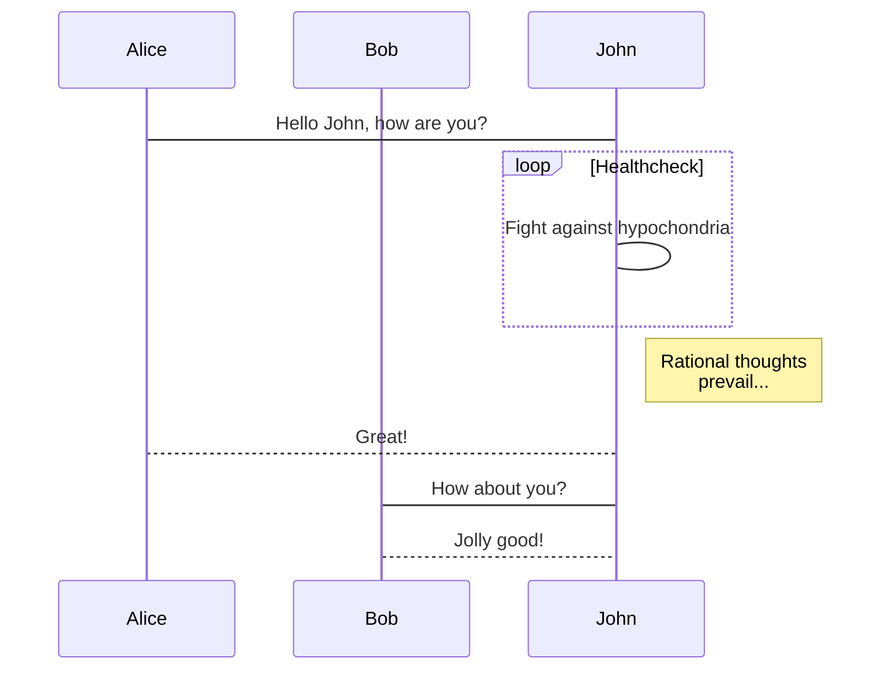
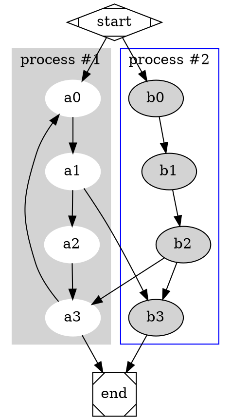
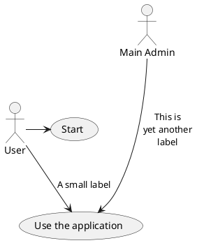

# Markdown 语法

## 首先应该了解的

每一个 Markdwon 使用者都应该了解的，是 Markdown 最基本的版本，也就是最官方的版本。它是如何创造出来的？它的设计哲学和语法是什么？如果你没看过，建议一定要看看这篇：**[Markdown 語法官方說明繁體中文版](mweblib://14187363924694)** 。

MWeb 采用的语法是 Github Flavored Markdown 语法，简称 GFM 语法，GFM 是官网版本的扩展版，除了支持官方的语法外，还支持表格、TOC、LaTeX、代码块、任务列表、脚注等。

另外 MWeb 在兼容 GFM 语法的基础上，还扩展支持两种比较有用的语法：画图支持（mermaid, viz, echarts, plantuml, sequence, flow）和设置图片宽度，下面会仔细说明。


## Markdown 的设计哲学

> Markdown 的目標是實現「易讀易寫」。
> 不過最需要強調的便是它的可讀性。一份使用 Markdown 格式撰寫的文件應該可以直接以純文字發佈，並且看起來不會像是由許多標籤或是格式指令所構成。
> Markdown 的語法有個主要的目的：用來作為一種網路內容的*寫作*用語言。
    
<!-- more -->

## 本文约定
    
如果有写 `效果如下：`， 在 MWeb 编辑状态下只有用 `CMD + 4` 或 `CMD + R` 预览才可以看效果。你可以直接下载本文然后在 MWeb 中打开以查看效果，下载网址为：[下载本文 Markdown](media/15302852139239/markdown%20syntax.md)
## 标题

Markdown 语法：

```
# 第一级标题 `<h1>` 
## 第二级标题 `<h2>` 
###### 第六级标题 `<h6>` 
```

效果如下：

# 第一级标题 `<h1>` 
## 第二级标题 `<h2>` 
###### 第六级标题 `<h6>` 


## 强调

Markdown 语法：

```
*这些文字会生成`<em>`*
_这些文字会生成`<u>`_

**这些文字会生成`<strong>`**
__这些文字会生成`<strong>`__
```

在 MWeb 中的快捷键为： `CMD + U`、`CMD + I`、`CMD + B`
效果如下：

*这些文字会生成`<em>`*
_这些文字会生成`<u>`_

**这些文字会生成`<strong>`**
__这些文字会生成`<strong>`__

## 换行

四个及以上空格加回车。
如果不想打这么多空格，只要回车就为换行，请打开 `偏好设置` - `主题&样式` 勾选：`把换行转为 <br /> 标签`，这项默认是勾选状态的。

## 列表

### 无序列表

Markdown 语法：

```
* 项目一 无序列表 `* + 空格键`
* 项目二
	* 项目二的子项目一 无序列表 `TAB + * + 空格键`
	* 项目二的子项目二
```

在 MWeb 中的快捷键为： `Option + U`
效果如下：

* 项目一 无序列表 `* + 空格键`
* 项目二
	* 项目二的子项目一 无序列表 `TAB + * + 空格键`
	* 项目二的子项目二

### 有序列表

Markdown 语法：

```
1. 项目一 有序列表 `数字 + . + 空格键`
2. 项目二 
3. 项目三
	1. 项目三的子项目一 有序列表 `TAB + 数字 + . + 空格键`
	2. 项目三的子项目二
```

效果如下：

1. 项目一 有序列表 `数字 + . + 空格键`
2. 项目二 
3. 项目三
	1. 项目三的子项目一 有序列表 `TAB + 数字 + . + 空格键`
	2. 项目三的子项目二

### 任务列表（Task lists）

Markdown 语法：

```
- [ ] 任务一 未做任务 `- + 空格 + [ ]`
- [x] 任务二 已做任务 `- + 空格 + [x]`
```

效果如下：

- [ ] 任务一 未做任务 `- + 空格 + [ ]`
- [x] 任务二 已做任务 `- + 空格 + [x]`

## 图片

Markdown 语法：

```

格式: 
```

`Control + Shift + I` 可插入Markdown语法。
如果是 MWeb 的文档库中和外部模式中引入的文件夹中的文档，还可以用截图并粘贴、复制并粘贴、拖拽等方式插入图片。

效果如下：


MWeb 引入的特别的语法来设置图片宽度，方法是在图片描述后加 `-w + 图片宽度` 即可，比如说要设置上面的图片的宽度为 140，语法如下： 

```

```


在 MWeb 中，你还可以设置图片的对齐，以上面的图片为例子，左对齐为 `-l140`，居中为 `-c140`，居右为 `-r140`。


## 链接

Markdown 语法：

```
email <example@example.com>
[GitHub](http://github.com)
自动生成连接  <http://www.github.com/>
```

`Control + Shift + L` 可插入Markdown语法。
如果是 MWeb 的文档库中和外部模式中引入的文件夹中的文档，拖放或 `CMD + Option + I` 导入非图片时，会生成连接。
效果如下：

Email 连接： <example@example.com>
[连接标题Github网站](http://github.com)
自动生成连接像： <http://www.github.com/> 这样

## 区块引用

Markdown 语法：

```
某某说:
> 第一行引用
> 第二行费用文字
```

`CMD + Shift + B` 可插入Markdown语法。
效果如下：

某某说:
> 第一行引用
> 第二行费用文字

## 行内代码

Markdown 语法：

```
像这样即可：`<addr>` `code`
```

`CMD + K` 可插入Markdown语法。
效果如下：

像这样即可：`<addr>` `code`

## 多行或者一段代码

Markdown 语法：

	```js
	function fancyAlert(arg) {
	  if(arg) {
	    $.facebox({div:'#foo'})
	  }

	}
	```

`CMD + Shift + K` 可插入Markdown语法。
效果如下：

```js
function fancyAlert(arg) {
	if(arg) {
		$.facebox({div:'#foo'})
	}

}
```

## MWeb 画图

### mermaid

mermaid 是比较流行的画图库，它支持流程图、顺序图和甘特图，它的官网为：<https://mermaidjs.github.io/> ，在 MWeb 中使用 mermaid 的语法就是声明代码块的语言为 mermaid，代码块中再写上 mermaid 的画图语法即可，你可以把下面的语法复制到 MWeb 中查看效果。

    ```mermaid
    sequenceDiagram
        participant Alice
        participant Bob
        Alice->John: Hello John, how are you?
        loop Healthcheck
            John->John: Fight against hypochondria
        end
        Note right of John: Rational thoughts <br/>prevail...
        John-->Alice: Great!
        John->Bob: How about you?
        Bob-->John: Jolly good!
    ```
 
**效果如下：**
 

    
### Graphviz

Graphviz 是开源的画图软件，它的官网为 <http://www.graphviz.org/>。MWeb 采用的是 Graphviz 的 js 版本的实现 <http://viz-js.com/>，可以解析 Graphviz 语法以生成图片。你可以将以下语法复制到 MWeb 中进行尝试。在尝试时可以把 dot 换成 circo, fdp, neato, osage, twopi 这几种来尝试效果。

    ```dot
    # http://www.graphviz.org/content/cluster
    digraph G {
    
    	subgraph cluster_0 {
    		style=filled;
    		color=lightgrey;
    		node [style=filled,color=white];
    		a0 -> a1 -> a2 -> a3;
    		label = "process #1";
    	}
    
    	subgraph cluster_1 {
    		node [style=filled];
    		b0 -> b1 -> b2 -> b3;
    		label = "process #2";
    		color=blue
    	}
    	start -> a0;
    	start -> b0;
    	a1 -> b3;
    	b2 -> a3;
    	a3 -> a0;
    	a3 -> end;
    	b3 -> end;
    
    	start [shape=Mdiamond];
    	end [shape=Msquare];
    }
    ```

**效果如下：**



### echarts

echarts 是百度出口的 js 画图库，它的网址为：<http://echarts.baidu.com/index.html>，功能非常强大，MWeb 支持 echarts 的一些基本的用法，太高级的不支持。你可以将以下语法复制到 MWeb 中进行尝试。你也可以去 <http://echarts.baidu.com/examples/index.html> 这个网址查看一些例子，要注意的是 MWeb 只能解析 `option = {}` 这种简单的，不过应该是足够使用了。

    ```echarts
    option = {
        xAxis: {
            type: 'category',
            data: ['Mon', 'Tue', 'Wed', 'Thu', 'Fri', 'Sat', 'Sun']
        },
        yAxis: {
            type: 'value'
        },
        series: [{
            data: [820, 932, 901, 934, 1290, 1330, 1320],
            type: 'line'
        }]
    };
    ```

**效果如下：**

```echarts
option = {
    xAxis: {
        type: 'category',
        data: ['Mon', 'Tue', 'Wed', 'Thu', 'Fri', 'Sat', 'Sun']
    },
    yAxis: {
        type: 'value'
    },
    series: [{
        data: [820, 932, 901, 934, 1290, 1330, 1320],
        type: 'line'
    }]
};
```
### plantuml

plantuml 的网址为：<http://www.plantuml.com/>，直接上去看更能了解。MWeb 对 plantuml 的支持的方式是引用 plantuml 服务器生成的图片，你可以将以下语法复制到 MWeb 中进行尝试。

    ```plantuml
    @startuml
    
    User -> (Start)
    User --> (Use the application) : A small label
    
    :Main Admin: ---> (Use the application) : This is\nyet another\nlabel
    
    @enduml
    ```

**效果如下：**



### 顺序图和流程图

顺序图和流程图是使用 <http://bramp.github.io/js-sequence-diagrams/>, <http://adrai.github.io/flowchart.js/> 这两个画图库，以下是它在 MWeb 中的 Markdown 语法。

	```sequence
	张三->李四: 嘿，小四儿, 写博客了没?
	Note right of 李四: 李四愣了一下，说：
	李四-->张三: 忙得吐血，哪有时间写。
	```

	```flow
	st=>start: 开始
	e=>end: 结束
	op=>operation: 我的操作
	cond=>condition: 确认？

	st->op->cond
	cond(yes)->e
	cond(no)->op
	```

**效果如下：**

```sequence
张三->李四: 嘿，小四儿, 写博客了没?
Note right of 李四: 李四愣了一下，说：
李四-->张三: 忙得吐血，哪有时间写。
```

```flow
st=>start: 开始
e=>end: 结束
op=>operation: 我的操作
cond=>condition: 确认？

st->op->cond
cond(yes)->e
cond(no)->op
```

## 表格

Markdown 语法：

```
第一格表头 | 第二格表头
--------- | -------------
内容单元格 第一列第一格 | 内容单元格第二列第一格
内容单元格 第一列第二格 多加文字 | 内容单元格第二列第二格
```

效果如下：

第一格表头 | 第二格表头
--------- | -------------
内容单元格 第一列第一格 | 内容单元格第二列第一格
内容单元格 第一列第二格 多加文字 | 内容单元格第二列第二格


## 删除线

Markdown 语法：

	加删除线像这样用： ~~删除这些~~

效果如下：

加删除线像这样用： ~~删除这些~~

## 分隔线

以下三种方式都可以生成分隔线：

	***

	*****

	- - -

效果如下：

***

*****

- - -


## LaTeX （MathJax 渲染）

Markdown 语法：

```
块级公式：
$$	x = \dfrac{-b \pm \sqrt{b^2 - 4ac}}{2a} $$

\\[ \frac{1}{\Bigl(\sqrt{\phi \sqrt{5}}-\phi\Bigr) e^{\frac25 \pi}} =
1+\frac{e^{-2\pi}} {1+\frac{e^{-4\pi}} {1+\frac{e^{-6\pi}}
{1+\frac{e^{-8\pi}} {1+\ldots} } } } \\]

行内公式： $\Gamma(n) = (n-1)!\quad\forall n\in\mathbb N$
```

效果如下（如果没看到公式，请勾选 `偏好设置` - `主题&样式` - `启用 LaTeX（MathJax）` 即可）：

块级公式：
$$	x = \dfrac{-b \pm \sqrt{b^2 - 4ac}}{2a} $$

\\[ \frac{1}{\Bigl(\sqrt{\phi \sqrt{5}}-\phi\Bigr) e^{\frac25 \pi}} =
1+\frac{e^{-2\pi}} {1+\frac{e^{-4\pi}} {1+\frac{e^{-6\pi}}
{1+\frac{e^{-8\pi}} {1+\ldots} } } } \\]


行内公式： $\Gamma(n) = (n-1)!\quad\forall n\in\mathbb N$


## 脚注（Footnote）

Markdown 语法：

```
这是一个脚注：[^sample_footnote]
```

效果如下：

这是一个脚注：[^sample_footnote]

[^sample_footnote]: 这里是脚注信息


## 注释和阅读更多

<!-- comment -->
<!-- more -->

Actions->Insert Read More Comment *或者* `Command + .`
**注** 阅读更多的功能只用在生成网站或博客时，插入时注意要后空一行。

## TOC

Markdown 语法：

```
[TOC]
```

效果如下：

[TOC]


